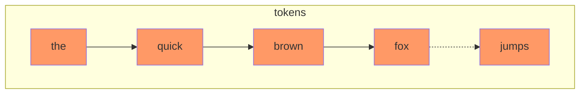
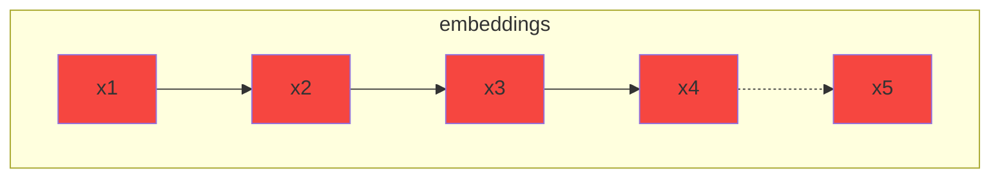
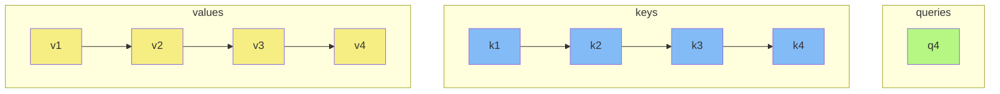
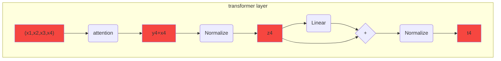

# Language model with transformers

This project is an attempt of implementing Transformers Deep Neural architecture where the neural network is learning a language model based on a corpus of text. Once trained, the network is able to find probable words than can continue the sentence. You can see an example, trained with few Sherlock Holmes novels , at http://mapariel.asuscomm.com/language/. The corpus used contains 300 000 words (about 900 pages) and the model starts to overfit after 3 or 4 epochs, meaning that even short sequences of words belonging to the same books, but not used for the training, would have infinitesimal chances to be generated by the model.

The work is inspired by the chapter 10 of the *Speech and Language Processing*[^1] book. The original idea is from the paper *Attention is All You Need*[^2].

The dimensions of the embeddings is 256 by default, and the transformer layer has 4 heads.

Here is the process for the "The quick brown fox" where the next word could be "jumps":

1. Each of the possible word of the used language is embedded as vector of 256 float numbers. "The quick brown fox" becomes $(x_1, x_2, x_3, x_4)$ where $x_i \in \mathbb{R}^{256}$

## Self attention and transformer layers

2. Three square matrices $K$, $Q$ and $V$, with 256 rows and columns,  transform the embeddings into keys, queries and values.
$$K \times x_i = k_i ,  Q \times x_i = q_i ,  \text{ and } V \times x_i = v_i$$ 

3. Computation of the dot products between the keys for the, quick, brown and fox and the query of fox  
$$k_1\cdot q_4  \qquad k_2 \cdot q_4 \qquad k_3 \cdot q_4  \qquad k_4 \cdot q_4$$
4. Computation of the softmax of those four numbers, the results are probabilities $p_1$, $p_2$, $p_3$, and $p_4$ and sum up to 1.
5. The output of the attention layer is the weighted sum of the vectors $v_i$
$$y_4=p_1 \cdot v_1 + p_2 \cdot v_2 + p_3 \cdot v_3 + p_4 \cdot v_4$$
6. The transfomer layer contains attention layer, followed by a normalization layer, a linear layer, and another normalization layer. There are two shortcuts around the attention and the linear layers.

## The language model
The model is fed with a sequence "the quick brown fox" and is outputing the probabilities of all the words of the vocabulary.
The model is composed by :
- embedding the 4 tokens in vectors of length 256
- transformer layer to output one vector of length 256
- linear layer to output one vector of length 6406 (the size of the vocabulary)
- softmax to compute the probabilities of each word of the vocabulary to be the next one 

## Training

For the training, the cross entropy loss is computed between the output probabilities and the class of the next token "jumps". The text is divided in sequences of 51 consecutive tokens. And each token of the sequence (except the last one) is fed to the network with the previous tokens, the target being the next word.  The computation of the keys queries dot products is done in parallel $(K \times X)^T \times (Q\times X) $, and masking the result matrix coefficients by $-\infty$ when $i$, index of the key, is bigger than $j$ the index of the query.

The learnable parameters are the coefficients of the linear layers, of the normalization layers, the embeddings, and the three matrices $K$, $Q$ and $V$ to compute the keys, queries and values.

## Positional encoding

With this model, the output of the transformer layer does not change when the sequence of tokens are scrambled. Meaning that "the lion is eating" and "is the lion eating" will give the same probability for the next token. In that case, the second sequence would be probably followed by the token question mark "?" whilst the former has very little chance to be followed by the same mark. For that reason, **positional encoding** is needed. This can be done in many ways, the solution here is the one from https://pytorch.org/tutorials/beginner/transformer_tutorial.html inspired by the original paper *Attention Is All You Need*.

## Multihead

To improve the accuracy of the model, four heads are used. It means that four transformers layers are used parallelly, taking as inputs embeddings, and that the results of these layers (four vectors of length 256) are concatenated before the last linear layer. 

[^1]: Klabunde R. Daniel Jurafsky/James H. Martin, Speech and Language Processing. Zeitschrift für Sprachwissenschaft. 2002;21(1):134–5.  
[^2]: Vaswani A, Shazeer N, Parmar N, Uszkoreit J, Jones L, Gomez AN, et al. Attention Is All You Need. arXiv.org. 2017 

