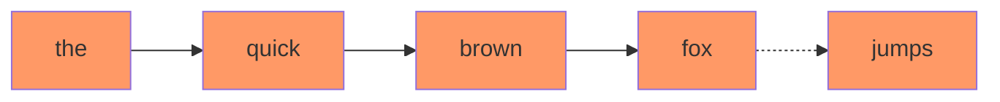
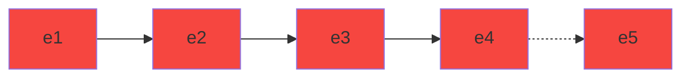

# Language model with transformers

This project is an attempt of implementing Transformers Deep Neural architecture where The neural network is learning a language model based of the text of a book. Once trained, the network is able to find the a probable word than can continue the sentence. You can see an example, trained with "Pride and Prejudice" by Jane Austen, at http://mapariel.asus.com/language .

The dimensions of the embeddings is 256 by default, and the transformer layer has 4 heads.

Here is the process for the "The quick brown fox" where the next word could be "jumps":

1. Each of the possible word of the used language is embedded as vector of 256 float numbers. "The quick brown fox" becomes $(e_1, e_2, e_3, e_4)$ where $e_i \in \mathbb{R}^{256}$

## Attention Layer

2. Three square matrices $K$, $Q$ and $V$, with 256 rows and columns,  transform the embeddings into keys, queries and values.
$$K \times e_i = k_i ,  Q \times e_i = q_i ,  \text{ and } V \times e_i = v_i$$ 
3. Computation of the dot products between the keys for the, quick, brown and fox and the query of fox  
$$k_1\cdot q_4  \qquad k_2 \cdot q_4 \qquad k_3 \cdot q_4  \qquad k_4 \cdot q_4$$
4. Computation of the softmax of those four numbers, the results are probabilities $p_1$, $p_2$, $p_3$, and $p_4$ and sum up to 1.
5. The output of the attention layer is the weighted sum of the vectors $v_i$
$$p_1 \cdot v_1 + p_2 \cdot v_2 + p_3 \cdot v_3 + p_4 \cdot v_4$$
